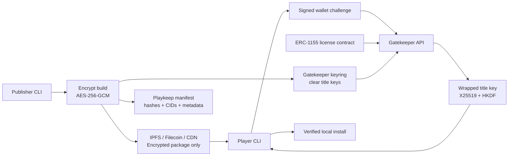

# Playkeep

<p align="center">
  <strong>Own the license. Mirror the bytes. Keep the game.</strong>
</p>

<p align="center">
  <a href="#quick-start">Quick Start</a> ·
  <a href="#docker-demo">Docker Demo</a> ·
  <a href="#manifesto">Manifesto</a> ·
  <a href="#architecture">Architecture</a> ·
  <a href="#security-model">Security</a>
</p>

<p align="center">
  
  
  
  
</p>

---

Playkeep is an open protocol prototype for sovereign digital game ownership.

The idea is simple: a player should not lose access to a game just because a launcher shuts down, a publisher delists a title, or a server-side store decides history is inconvenient. Playkeep separates the right to access a game from the server that happens to deliver it today.

## What It Does

- Tracks game licenses with an ERC-1155 smart contract.
- Encrypts game packages before they are published to IPFS, Filecoin, publisher CDNs, or community mirrors.
- Releases title keys only after wallet signature and token ownership verification.
- Lets publishers run fast cache servers without becoming the only point of access.
- Gives players a verifiable local install flow instead of blind trust in a closed launcher.

This is not a promise of impossible DRM. Once software is decrypted on a hostile machine, it can be copied. Playkeep focuses on the serious, defensible model: encrypted public bytes, token-gated keys, auditable ownership, and future support for per-license watermarking.

## Manifesto

Games are culture, memory, craft, and identity. They should not disappear because an account system changed, a storefront was sunset, or a license database became unprofitable to maintain.

We believe:

- Buying a game should mean durable access, not temporary permission hidden behind a launcher.
- Preservation should be designed into distribution from day one.
- Publishers deserve piracy resistance, but players deserve sovereignty.
- Open protocols beat private silos when the goal is trust.
- Digital ownership should be transferable, inspectable, recoverable, and boringly reliable.

Playkeep exists to make the honest path better than the pirate path: easier to verify, easier to preserve, easier to resell, and easier to trust.

## Architecture



## Packages

- `packages/contracts`: Solidity ERC-1155 license registry.
- `packages/sdk`: manifest, crypto, signature, and key-wrapping primitives.
- `apps/gatekeeper`: HTTP API that verifies ownership and wraps title keys to a device public key.
- `packages/cli`: publisher/player command line tools.
- `packages/e2e`: complete demo flow test.
- `scripts/demo`: Docker/local demo helpers.
- `docs`: architecture and threat model.

## Quick Start

```bash
pnpm install
pnpm test
pnpm build
```

Run a specific test suite:

```bash
pnpm test:unit
pnpm test:integration
pnpm test:e2e
```

See [docs/TESTING.md](docs/TESTING.md) for the suite boundaries.

The public website is served from [docs/](docs/) through GitHub Pages. DNS setup notes live in
[docs/DNS.md](docs/DNS.md).

Create an encrypted package:

```bash
pnpm --filter @playkeep/cli playkeep publisher seal \
  --input ./my-game-build \
  --out ./.playkeep/out \
  --game-id demo-game \
  --title "Demo Game" \
  --version 1.0.0 \
  --platform pc-windows
```

Run the gatekeeper:

```bash
copy .env.example .env
pnpm --filter @playkeep/gatekeeper dev
```

For production-like local use, configure either:

- `PLAYKEEP_RPC_URL` + `PLAYKEEP_CONTRACT_ADDRESS`;
- or `PLAYKEEP_MOCK_OWNERSHIP_PATH` for local testing;
- or `PLAYKEEP_DEV_ALLOW_ALL=true` only for throwaway demos.

## Docker Demo

The Docker demo creates a tiny game package containing one file:

```text
Hello PlayKeep.io
```

Then it runs the full flow:

1. publisher seals and encrypts the game;
2. a demo wallet is granted mock ownership;
3. the gatekeeper starts;
4. the player signs a challenge;
5. the gatekeeper verifies ownership and wraps the title key;
6. the player downloads, decrypts, verifies, and extracts the file.

Run it:

```bash
docker compose up --build --abort-on-container-exit demo-install
```

You should see:

```text
Playkeep demo install verified
Hello PlayKeep.io
```

## Local Demo Test

```bash
pnpm demo:e2e
```

The e2e test starts an in-process gatekeeper over HTTP and verifies the complete `Hello PlayKeep.io` install flow.

## Security Model

The secure path is:

1. Publisher encrypts game build locally.
2. Publisher uploads only encrypted bytes to IPFS/cache.
3. Player signs a gatekeeper challenge with the wallet that owns the license token.
4. Gatekeeper checks token balance on-chain or through an explicit local verifier.
5. Gatekeeper wraps the title key to the player's ephemeral device public key.
6. Player decrypts locally and verifies hashes from the manifest.

Playkeep prevents useful public downloads without authorization. It does not pretend that decrypted software on a hostile machine is uncopyable. The next serious anti-piracy layer is per-license watermarking and device-aware key leases.

See [docs/ARCHITECTURE.md](docs/ARCHITECTURE.md) and [docs/THREAT_MODEL.md](docs/THREAT_MODEL.md).

## Roadmap

- Real IPFS upload/pinning adapter.
- Filecoin storage deal integration.
- Publisher build signing.
- Per-license watermarking pipeline.
- Threshold key network replacing the single gatekeeper.
- Wallet recovery and inheritance policy.
- Resale marketplace primitives.

## License

MIT. Build it, fork it, audit it, argue with it, improve it.
